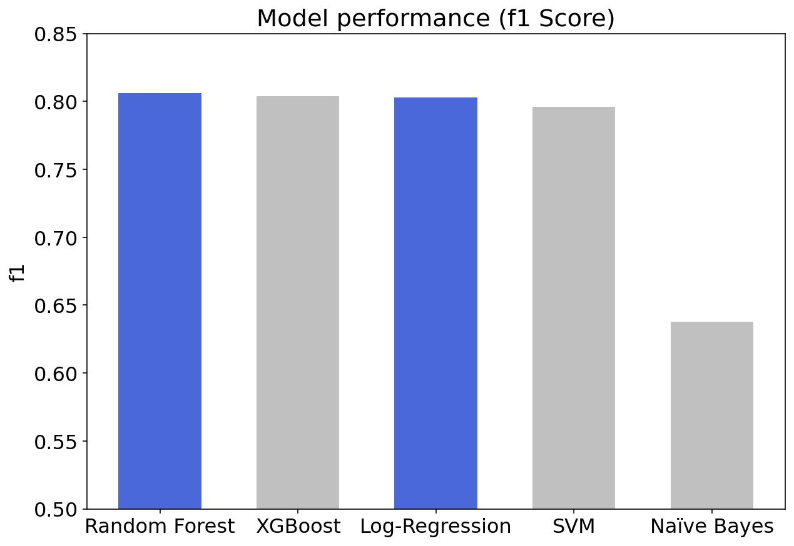

<style>
d-title {
  text-align: left}
h1 {font-size: 24px}
body {text-align: justify}
</style>


```{r setup, include=FALSE}
knitr::opts_chunk$set(echo = FALSE)
```

## Abstract 

This paper employs Machine Learning techniques to predict voting propensity in the 2019 European Parliament election. Among the models examined, a Random Forest produces the most accurate predictions, achieving a F1 score of 0.81. Importantly, the Random Forest only marginally outperforms the baseline Logistic Regression model (F1 score 0.80). To interpret the Random Forest substantively, we examine the global feature importance with SHAP. We find that the single most important driver of voting in the European Parliament election is whether a respondent voted in her last national election.

## Introduction

In recent years, polling firms were wrong quite decisively in some major instances such as the 2015 UK General Election or the 2016 US Presidential Election. In both examples, a failure to accurately predict voter turnout was the primary cause behind these flawed predictions. 

While the topic of voting propensity has been studied extensively, most research designs typically rely on a relatively small set of data and traditional statistical models. By contrast, this paper employs current Machine Learning techniques to predict voting propensity in the 2019 European Elections. Using individual-level survey data from the Eurobarometer 91.5, we compute a Logistic Regression model as our baseline, against which we then assess a range of challenger models. Out of four challenger models, a Random Forest is performing the best, achieving a F1 score of 0.806. However, the Random Forest is only slightly outperforming the baseline Logistic Regression model, which achieved a F1 score of 0.803. These findings suggest that there is limited rationale to diverge from traditional statistical methods for the endeavor of predicting voting propensity from survey data. 

Next, we identify the features driving voter turnout. We use SHAP to compute the global feature importance of our Random Forest and additionally examine local feature importance with LIME. This analysis reveals that the single most important feature relates to whether a respondent voted in the last national election, followed by respondents' self-identification on the political left-right scale and the impression whether one’s voice counts in the EU or the country of origin. While these findings overall confirm prior empirical and theoretical work, they do convey relevant guidance to practitioners. For instance, polling institutes should ensure to include these questions in their likely voter models.

## Related Work 

There exists a growing body of political science literature which employs state-of-the-art Machine Learning models to predict voting propensity. @bach2021 for instance use digital trace data from web and mobile browsing to predict voting propensity in the German context. A small number of studies applied Machine Learning models to survey data for the prediction of voting propensity [@Challenor]. However, all research in this field is primarily focused on the US and underdeveloped in the context of European elections; a gap which our project aims to fill. 

## Proposed Method 

**Prediction**:

A challenge when predicting voter turnout from the vast number of questions collected in the European Parliament Post Election Survey (EPPES) relates to the relative sparsity of the data. After pre-processing, our dataset contains approximately 900 variables and 27,000 observations. Additionally, many questions related to respondents’ opinions display a concentration of responses around few categories. Considering these challenges, we expect a non-parametric model to outperform our parametric baseline. In total, we test five models. (1) Logistic Regression model (baseline). (2) Naïve Bayes. (3) Support Vector Machine (SVM). (4) Random Forest. (5) XG Boost.

**Feature Importance**:

We compute SHAP (SHapley Additive exPlanations) and LIME (Local interpretable model-agnostic explanations) values for our Random Forest model to tackle our second project goal relating to our model’s interpretability. Both methods are superior to alternative approaches like Permutation Feature Importance because they establish the nature of the relationship between predictors and the outcome variable, i.e., whether it is positively or negatively affecting voting propensity. Further, they are unaffected by multicollinearity between predictors, which we expect to observe [@Molnar]. 

## Experiments 

# Data: 

In our project, we use the dataset of the Eurobarometer 91.5 European Parliament Post-Election Survey 2019 (EPPES). The Eurobarometer regularly surveys citizens on public opinion about a broad range of topics related to the EU and other political and social issues. The poll was conducted among citizens aged 15 years and above in all EU member states and the five candidate countries at that time (Turkey, North Macedonia, Montenegro, Serbia and Albania). Around 1,000 interviews were conducted in every EU member state

Apart from the core questions of the Standard Eurobarometer, the EPPES also includes questions about the public perception towards the EU, its institutions and, importantly, whether the respondent voted in the last European Parliament Election in May 2019. The survey is particularly suited to our goal of predicting voting propensity since the data was collected shortly after the election (07.06.2019 - 01.07.2019), working against issues like selective memory or winning bias, which often confound self-reported voting measures

# Experimental details:

All model computations on training data are performed with k-fold, stratified, repeated cross-validation. Whenever feasible, the data is split into 10 folds at 3 repetitions. We reduce the number of folds for SVM and Random Forest to manage computation time. By using stratified cross-validation, we account for the imbalances in our data. The hyperparameters of the Logistic Regression model and SVM are tuned with grid search. In contrast, we rely on random search to explore a larger number of parameters for the Random Forest and the XG Boost model. 

To interpret our black box models, we compute SHAP for our best performing model, the Random Forest. Because SHAP is computationally intensive, especially in the presence of many features, we fit a simplified Random Forest with only minor losses in predictive power. For global feature importance, we calculate the Shapley values for our random forest using the TreeShap algorithm, a variant of SHAP optimized for tree-based methods. When explaining individual predictions, we stick to the SHAP kernel, as it allows for better comparability to LIME.

# Results: 

**Prediction**:

To evaluate the performance of our models, we fit our best-performing models on the unseen test data. The plot below reports the F1 score, our key performance metric, for all models. Out of our challenger models, a Random Forest achieved the highest F1 score (0.806), minorly outperforming the baseline Logistic Regression (0.803).

Contrary to our ex-ante expectation, the Random Forest has only weakly outperformed Logistic Regression. A possible explanation is offered by a large-scale benchmarking experiment from 2018\cite{Couronne}. The authors find that random forest outperforms Logistic Regression in 69.0\% of all binary classification problems. Their analysis reveals further that if the number of features relative to observations were to increase in our model, this would likely amplify the outperformance of the Random Forest.

```{r fig1, eval = TRUE, echo = FALSE, out.width = '100%', fig.cap = "Comparison of model performance"}

```

**Feature Importance**:

The plot below depicts the global feature importance for the 10 most important features in our Random Forest. The features are ranked by the size of their Shapley values, whereby higher values are associated with greater importance. The single most important feature relates to whether a respondent voted in her last national election, followed by respondents' self-identification on the political left-right scale and the impression whether one’s voice counts in the EU or the country of origin. We validated these findings by computing the local feature importance for a sample of local incidence, which are overall consistent with the global values.^[While we do not report these estimates here for reasons of brevity, details can be found in our paper.] 

Our findings corroborate existing literature on voting behaviour that establishes a habitual connection between voting in national and European elections [@blais2015decision]. Beyond the most important feature, our findings highlight the importance of the political left-right scale. In the context of European elections, this might reflect trends of Euroscepticism among parties of the political right [@hernandez2016turning]. Finally, feeling that one’s vote matters both nationally and on a European level, combined with the three features on discussing political issues with friends or relatives, may point towards the role of informal social networks and social psychological literature in explaining individual voting propensity [@abrams_iversen_soskice_2011].

```{r fig2, eval = TRUE, echo = FALSE, out.width = '100%', fig.cap = "Global feature importance"}

```

# Conclusion

This paper employs Machine Learning models to estimate voting propensity in the 2019 European Parliament Election from survey data. Presented with this task, more complex Machine Learning models fail to outperform the standard Logistic Regression model. Considering that Logistic Regression models typically provide better interpretability and faster performance, this presents strong evidence in favour of the established computational approach. Moreover, this paper showed that voting in European Parliament elections is strongly influenced by voting behaviour in national elections. Other important features include the self-identification on the political left-right scale, the impression whether one’s voice counts in the EU or the country of origin, and the age of the respondent. 

The first caveat on these findings concerns their generalisability. For instance, it is unclear to what extent voting behaviour in European Parliament election extends to national elections. Similarly, the survey questions were strongly focused on views on European political issues. A survey with more holistic questions might produce different results. A second caveat relates to incorrect self-reporting in surveys. For instance, respondents likely exert some social desirability bias likely leading to overreporting of those who say they voted in the last elections. Future research could extend the here presented methodology to other elections. Moreover, it might be productive to predict voting behaviour from a combination of survey and digital trace data. 
